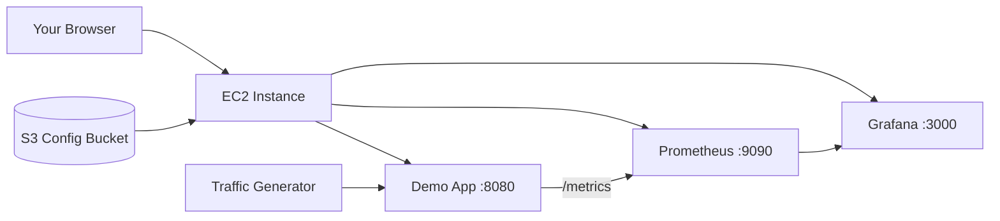

# Monitoring Stack on AWS (Terraform)

Deploy a demo application with **Prometheus** and **Grafana** entirely on **AWS**. Nothing runs locally except the Terraform commands that create the infrastructure.

## Architecture



Terraform provisions:
- **EC2** instance (Amazon Linux 2023) with Docker
- **S3** bucket with app, Prometheus, and Grafana configs
- **Security group** exposing Grafana, Prometheus, and the app
- **Elastic IP** for a stable public URL

## What you get

| Service | Port | Purpose |
|---------|------|---------|
| **Grafana** | 3000 | Graphical dashboards |
| **Prometheus** | 9090 | Metrics database |
| **Demo App** | 8080 | Sample web application |

**Grafana login:** `admin` / `admin123` (change via `grafana_admin_password`)

The **Demo App Monitoring** dashboard shows request rate, latency, CPU, memory, and active users. A traffic generator keeps charts populated with live data.

## Prerequisites

1. [Terraform](https://developer.hashicorp.com/terraform/install) >= 1.5
2. [AWS CLI](https://docs.aws.amazon.com/cli/latest/userguide/getting-started-install.html) configured with credentials
3. An AWS account with permissions for EC2, S3, IAM, and EIP

Configure AWS credentials:

```powershell
aws configure
```

Or set environment variables:

```powershell
$env:AWS_ACCESS_KEY_ID = "your-key"
$env:AWS_SECRET_ACCESS_KEY = "your-secret"
$env:AWS_DEFAULT_REGION = "us-east-1"
```

## Deploy

```powershell
cd "D:\animioui\Grafana\New folder\terraform"
terraform init -upgrade
terraform apply
```

Type `yes` when prompted. After apply completes, wait **3–5 minutes** for EC2 to bootstrap, then open the URLs from the output:

```powershell
terraform output grafana_url
terraform output prometheus_url
terraform output demo_app_url
```

In Grafana: **Dashboards → Demo App Monitoring**

## Customize

Copy the example variables file:

```powershell
copy terraform.tfvars.example terraform.tfvars
```

Edit `terraform.tfvars` to change region, instance size, or password. Restrict access by setting `allowed_cidr` to your IP (e.g. `"203.0.113.10/32"`).

## SSH access

1. Create an EC2 key pair in **AWS Console → EC2 → Key Pairs** (save the `.pem` file).
2. Set the key name in `terraform.tfvars`:
   ```hcl
   ssh_key_name     = "your-key-pair-name"
   ssh_allowed_cidr = "YOUR.IP.ADDRESS/32"
   ```
3. Run `terraform apply`, then connect:
   ```powershell
   ssh -i C:\path\to\your-key.pem ec2-user@YOUR_PUBLIC_IP
   ```
   Or use: `terraform output ssh_command`

On the server you can check logs with:
```bash
sudo tail -f /var/log/user-data.log
docker compose -f /opt/monitoring/docker-compose.yml ps
```

## Tear down

```powershell
cd terraform
terraform destroy
```

This removes the EC2 instance, Elastic IP, S3 bucket, and all related AWS resources.

## Project structure

```
├── app/                  # Demo Flask app with /metrics endpoint
├── prometheus/           # Prometheus scrape config
├── grafana/              # Grafana datasource + dashboard
├── docker-compose.yml    # Stack definition (runs on EC2)
└── terraform/            # AWS Terraform scripts
    ├── main.tf
    ├── variables.tf
    ├── outputs.tf
    ├── versions.tf
    └── user_data.sh.tpl  # EC2 bootstrap script
```

## Replace the demo app

1. Edit files in `app/`
2. Run `terraform apply` again (configs are re-uploaded to S3 and EC2 is reprovisioned)

## Estimated AWS cost

- **t3.small** EC2: ~$15/month if left running 24/7
- **Elastic IP**: free while attached to a running instance
- **S3**: negligible for config files

Run `terraform destroy` when not in use to avoid charges.

## Troubleshooting

**Services not ready yet?** Wait 3–5 minutes after `terraform apply`, then refresh Grafana.

**Check EC2 bootstrap logs** (via AWS Console → EC2 → Instance → Monitor → Get system log, or SSM):

```powershell
aws ec2 get-console-output --instance-id (terraform output -raw instance_id)
```

Look for `Monitoring stack is running on AWS EC2` in `/var/log/user-data.log`.
# Grafana_demo
